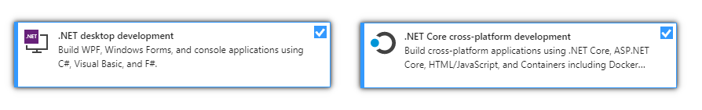

<a href="https://dev.azure.com/spelos/miunie/_apis/build/status/discord-bot-tutorial.Miunie?branchName=master">
  
</a>
<a href="https://github.com/discord-bot-tutorial/Miunie/graphs/contributors">
  
</a>
<a href="https://discord.gg/cGhEZuk">
  
</a>
<a href="https://github.com/discord-bot-tutorial/Miunie/blob/master/LICENSE">
  
</a>
<a href="https://discordbots.org/bot/411505318124847114" >
  
</a>

[](https://sourcerer.io/fame/petrspelos/discord-bot-tutorial/Miunie/links/0)[](https://sourcerer.io/fame/petrspelos/discord-bot-tutorial/Miunie/links/1)[](https://sourcerer.io/fame/petrspelos/discord-bot-tutorial/Miunie/links/2)[](https://sourcerer.io/fame/petrspelos/discord-bot-tutorial/Miunie/links/3)[](https://sourcerer.io/fame/petrspelos/discord-bot-tutorial/Miunie/links/4)[](https://sourcerer.io/fame/petrspelos/discord-bot-tutorial/Miunie/links/5)[](https://sourcerer.io/fame/petrspelos/discord-bot-tutorial/Miunie/links/6)[](https://sourcerer.io/fame/petrspelos/discord-bot-tutorial/Miunie/links/7)

💖 **Made possible by these amazing people!** 🏆

## About

**Miunie** is a community Discord bot project.

🎮 Run Miunie on your favorite platform!


Currently, Miunie can run on the following platforms:

|                   | Miunie.ConsoleApp | Miunie.WindowsApp | Miunie.AspNet |
|-------------------|:-----------------:|:-----------------:|--------------:|
| Windows 7         | ✅                | ❌               | ✅            |
| MacOS / Linux     | ✅                | ❌               | ✅           |
| Windows 10        | ✅                | ✅               | ✅            |
| IoT Devices       | ✅                | ✅               | ✅            |
| Mobile            | ❌                | ✅               | ✅           |
| Xbox              | ❌                | ✅               | ❔            |
| HoloLens          | ❌                | ✅               | ❔            |
| Surface Hub       | ❌                | ✅               | ❔            |

> ASP.NET implementation of Miunie is still under development.

🤠 **Wanna help?** Checkout the [contributing section](#contributing).

👩‍💻 **Wanna try it out?** See the [getting started guide](#getting-started).

🐛 **Found a bug?** Let us know by creating a [GitHub issue](https://github.com/discord-bot-tutorial/Miunie/issues/new).

💡 **Have an idea/suggestion?** Tell us all about it through a [GitHub issue](https://github.com/discord-bot-tutorial/Miunie/issues/new).

## Getting Started

These instructions are going to walk you through downloading a copy of Miunie and running it.

> 🔧 If you want to know how to setup your environment for development, see [this guide](CONTRIBUTING.md#setting-up-a-development-environment).

> ℹ️ Checkout our [deployment section](#deployment) for notes on how to set the project up for hosting on a dedicated machine.

## Prerequisites

- **IDE / Code Editor**

For picking which IDE to use, take a look at the following table.

* ⭐ - Recommended for a given platform
* ⚠ - Known issues for a given platform
* ✅ - Will work for a given platform

> _If you are a beginner, we suggest sticking to the ⭐ recommended options._

|                   | Miunie.ConsoleApp | Miunie.WindowsApp | Miunie.AspNet |
|-------------------|:-----------------:|:-----------------:|--------------:|
| [Visual Studio **2019** (Community)](https://visualstudio.microsoft.com/downloads/)| ⭐ | ⭐ | ⭐ |
| [Visual Studio 2017 (Community)](https://visualstudio.microsoft.com/downloads/)| ⚠ | ⚠ | ⚠ |
| [Visual Studio Code](https://code.visualstudio.com/)                           | ✅ | ❌ | ⚠  |
| [Rider: The Cross-Platform .NET IDE](https://www.jetbrains.com/rider/)         | ✅ | ❌ | ✅ |

- **Visual Studio Prerequisites**

During the installation process of Visual Studio, you should always include the following options:



If you would like to build the ASP.NET project, include the following option:


If you would like to build the Universal Windows Platform App, include the following option:


- **Ensuring .NET Core 2.2 (or higher) is installed**

To make sure you have the correct version of .NET Core, open your `command promt`/`Terminal`/`Powershell` and type in the following command:

```
dotnet --list-sdks
```

_Here is an example of this command's output on Windows:_

```
2.1.602 [C:\Program Files\dotnet\sdk]
2.2.202 [C:\Program Files\dotnet\sdk]
3.0.100-preview3-010431 [C:\Program Files\dotnet\sdk]
```

Your output will most likely differ a bit.

If you see a version higher or equal to `2.2`, you can continue to the next step.

If you don't see the right version or if you got a response similar to `Command not found`, you need to download an install the latest version of .NET Core.

You can install it [here](https://dotnet.microsoft.com/).

- **Getting a copy of the project**

> If you want to clone or fork this repository instead, please follow the [contributing guide](CONTRIBUTING.md).

Download the project by pressing the green "Clone or download" button and selecting the "Download ZIP" option.


Unzip the directory and navigate into the `src` folder inside it.

Open the `Miunie.sln` in your IDE.

🎉 Congratulations, you are now set up for building and running Miunie.

If you need more information about how to build and run the project, please contact us on our Discord server:

<a href="https://discord.gg/cGhEZuk">
  
</a>

## Installation

This is a step by step guide to get Miunie up and running on your machine.

1. [Get the source code](#getting-the-source)
2. [Setup your IDE](#setting-up-the-environment---visual-studio-ide)
3. [Setup a bot token](#setting-up-a-bot-token)

### Getting the source

1. [Fork The Original Repository](https://help.github.com/articles/fork-a-repo/)
2. Navigate to your fork.
3. [Clone](https://help.github.com/articles/cloning-a-repository/) your fork to your local machine.

### Setting up the environment - Visual Studio IDE

- The root directory of the project contains Miunie.sln, this is a solution file and you can open it with Visual Studio (See [Prerequisites](#Prerequisites))
- Once Visual Studio is open, you should try to [build the solution](https://docs.microsoft.com/en-us/visualstudio/ide/building-and-cleaning-projects-and-solutions-in-visual-studio?view=vs-2017).
  - You can do so by using the shortcut `F6` or going to `Build` > `Build Solution`.
- If the build fails due to some kind of error, make sure to fix it before continuing with this guide.

### Setting up the environment - Visual Studio Code

- Open Visual Studio Code
- Open the project's `src` folder (the one with `Miunie.sln` in it) in Visual Studio Code.
- To build the application, open the [Integrated Terminal](https://code.visualstudio.com/docs/editor/integrated-terminal) and type `dotnet build`.
- You should see the build succeeded with no errors.

### Setting up the environment - Rider IDE

- Open Rider IDE and on the "Welcome to JetBrains Rider" screen select the "Open Solution or Project" option.


- Navigate to your cloned Directory and select the `Miunie.sln` file.

- To build the project, navigate to `Build` > `Build Solution` or press <kbd>Ctrl</kbd> + <kbd>Shift</kbd> + <kbd>B</kbd>

### Setting up a bot token

The bot configuration is stored as an [XML](https://en.wikipedia.org/wiki/XML) file.

When you compile Miunie, the project uses the configuration from `Miunie.ConsoleApp/App.config`.

> ℹ️ In a compiled project, the configuration file is called `Miunie.ConsoleApp.dll.config`.

The project comes with a configuration template: `Miunie.ConsoleApp/App.config.template`. To use the template:

- Create a copy of the `App.config.template` file.
- Rename it to `App.config`
- Open the file for editing
- Find the line with `key="DiscordToken"`
- Replace the `Your-Token-Here` placeholder with your bot's token.

> ℹ️ Our repository is setup to ignore `App.config` to prevent you from accidentally committing your token into the repository.


## Running Tests

To run the unit tests already inclduded in the project follow the directions that are relevent to you.

- **Visual Studio IDE**
  - Either use the shortcut <kbd>CTRL</kbd> + <kbd>R</kbd>, <kbd>A</kbd> or go to `Test` > `Run` > `All Tests` 
  - Test output Example:
  


> ℹ️ You can `Restore` > `Build` > `Test` via the CLI as shown below in Visual Studio Code setup.

- **Visual Studio Code**
  - Open your terminal application and navigate into the project's `src` directory.
  - `dotnet test [Name of any .Tests directory]` - This runs the unit tests for specific modules. You should see a completed output stating that all tests passed.


- **Rider IDE**
  - To run the Project's unit tests, navigate to `Tests` > `Run Unit Tests`.
  - You should see the test results in a "Unit Tests" window:


// --

## Deployment

- **Deploying to a Raspberry Pi**

There is a two part video tutorial explaining how to deploy a .NET Core Bot onto a Raspberry Pi.
  - [**[PART 1]** Self-Host Discord bot on Raspberry Pi - Setting up the device](https://www.youtube.com/watch?v=JWXbIUETYY8)
  - [**[PART 2]** Self-Host Discord bot on Raspberry Pi - Deploying the bot](https://www.youtube.com/watch?v=O6ffnRcW9DM)

> ℹ️ Know a way to deploy Miunie to a different target? We'd love to see your suggestion in form of a [GitHub issue](https://github.com/discord-bot-tutorial/Miunie/issues/new).

## Known Bugs

There are currently no known bugs! Hooray!

## Built With

- [.Net Core 2.2](https://dotnet.microsoft.com/download/dotnet-core/2.2) - Platform Used
- [DsharpPlus](https://github.com/DSharpPlus/DSharpPlus) - Discord API wrapper library
- 💙 Collaborative spirit
- ❤️ Love and Care

## Contributing

There is a number of different tasks you can help with, including non-programming ones. This is a community project that wouldn't be possible without the help of **amazing people like yourself**. <3

Your contributions might include:
- Grammar/Spelling fixes to document files (such as this README)
- Grammar/Spelling fixes to embedded text resources Miunie uses at runtime.
- Improving documentation
- New features you implement
- Feature and Bug fixes
- Suggestions & Ideas in form of a GitHub issue
- Reviewing Pull Requests made by other contributors
- _And more..._

If you are interested, feel free to read a more detailed [CONTRIBUTING.md guide](CONTRIBUTING.md) that will walk you through your first contribution.

## Versioning

There is currently no versioning system used. Feel free to create a new Issue suggesting one.

## Authors

- Petr Sedláček - Initial work - [PetrSpelos](https://github.com/petrspelos)

See also the list of [contributors](https://github.com/discord-bot-tutorial/Miunie/graphs/contributors) who participated in this project.

## License

This project is licensed under the MIT License - see the [LICENSE](https://github.com/discord-bot-tutorial/Miunie/blob/master/LICENSE) file for details

## Acknowledgments

- Thank you to all people who contributed, especially those coming from my Discord-BOT-Tutorial Discord Server.
