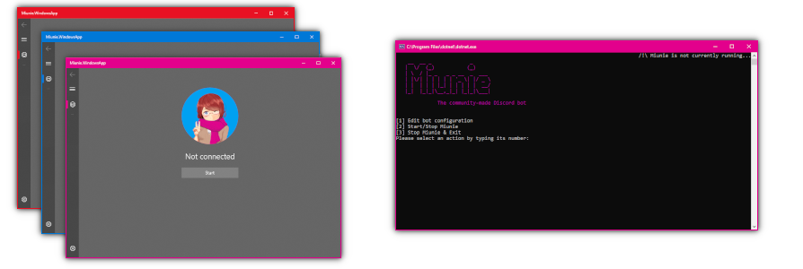

**🧡 Miunie is built by these wonderful people:**

**💚 Special thanks to:**

- 🎨 **[wayanfa](https://www.instagram.com/haelequin_55/)** for drawing Miunie.

**Miunie** is a community Discord bot project.

## [🔗 Learn more about Miunie...](https://github.com/control-net/Miunie/wiki/About-Miunie)

## Releases

| Platform | Release | Version |
| ------ | ------ | ------ |
| Windows 10 |  | UWP

## Useful links

## [🔗 How to help the project](https://github.com/control-net/Miunie/wiki/How-to-help)

## [🔗 How to build Miunie from source](https://github.com/control-net/Miunie/wiki/Getting-started-with-Miunie)

## [🔗 How to deploy Miunie](https://github.com/control-net/Miunie/wiki/Deploying-Miunie)

## Built With

- [.Net Core 3.1](https://dotnet.microsoft.com/download/dotnet-core) - Platform Used
- .NET Standard 2.0
- .NET Framework
- [Discord.NET](https://github.com/discord-net/Discord.Net) - Discord API wrapper library
- 💙 Collaborative spirit
- ❤️ Passion

## Authors

- Petr Sedláček - Initial work - [petrspelos](https://github.com/petrspelos)

See also the list of [contributors](https://github.com/control-net/Miunie/graphs/contributors) who participated in this project.

## License

This project is licensed under the GPL-3.0 License - see the [LICENSE](https://github.com/control-net/Miunie/blob/master/LICENSE) file for details
